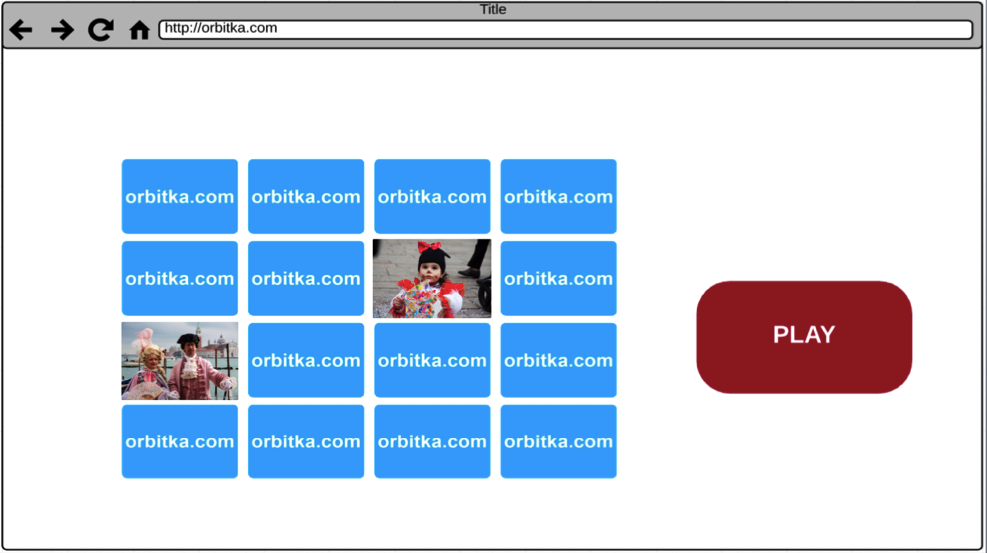

#SIMPLE MEMORY GAME

Play the game here:  
http://orbitka.github.io/New_Memory_Game/

#Main functionalities:

- This is a simple memory game based on javaScript (with HTML page structure and CSS styling). 

- The objective is to find hidden pairs of cards.

- Cards are made of colorful travel photos.

- The game board consists of pairs of cards turned face down.

- Player clicks 2 cards, they turn face up. If both cards match, they stay up, otherwise they turn back and hide again.

- When all cards are turned face up the game ends.

##Mechanism:

- Pairs of cards are stored in the array.

- Array is rearranged in random order and the cards are sent to the board and appended to dynamically created divs.

- Assigned "Mouseclick" to button PLAY starts the game.

- Assigned "Mouseclick" to cards turns two selected cards up.

- Selected cards are compared: if they are the same, they stay up, else they turn back after 1-sec. "timeout".

- When all the cards are matched the game is finished.

- Press the button NEW GAME to reset the board, change the order of cards and play again.
